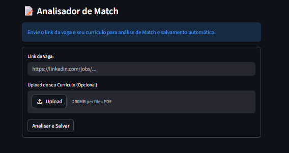

[0.1] - 14/05/2026

### Added

- app.py code

[0.2] - 15/05/2026

#### Removed

- The Telegram Module. The idea was scrapped for now.

#### Added

- Now the Streamlit site can receive the link, send the info to the Webhook from Make.com, than send to the Gemini modules, the Gemini analyzes the job description, and then store it successfully in the Notio0n database.

- A pre-functioned button who searches "Buscar 3 vagas de Dev Júnior em Mogi das Cruzes ou Próximo" in the web

[0.3] - 16/05/2026
### To-do
- Add a separate button only for the analisys.
- Add a separate button to save the vacancy in the notion database.

[0.4] - 17/05/2026

- Modified :
    
### O que fiz ⬇️