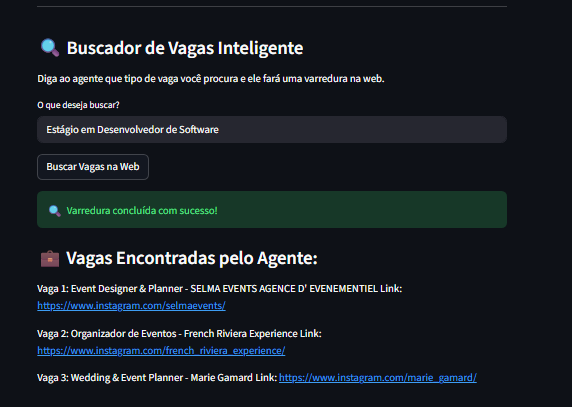

# Agente-de-Vagas

#### Things to do
- The AI allucinates giving a match even though theres curriculum PDF uploaded to compare.
- The Buscador de Vagas Inteligentes is not working as expected yet. 

# 1. Apresentação do grupo e do problema / aprox. 45 segundos (Ericles)
- Aparecer na câmera e dizer seus nomes. 
- Explicar o problema que o Agente resolve com clareza. 
- O público-alvo é apresentado

# 2. Demonstração ao vivo do agente funcioando / aprox. 1 min 30 seg (Nathan)
- Exibir tela/interface na gravação.
- Pelos menos demonstrar 2 exemplos de entrada e resposta da IA.
- Demonstrar ao vivo. Não pode ser prints.

# 3. Explicação do Fluxo Técnico / aprox. 1 minuto (Nathan)
- Explicar o fluxo complexo : Interface > Automação > IA > Dados
- As ferramentas usadas (Streamlit, Make, Gemini, Notion)

# 4. Exibição dos Prompts Utilizados / aprox. 30 segundos (Interface)
- Exibir o prompt profissional na tela
- Explicar brevemente por que o prompt foi feito dessa forma

# 5. Análise Crítica /  aprox. 45 segundos (Ericles)
- Citar ao menos limitação técnica do agente (Limite de uso graututio do LLM)
- Mencionar risco ético, de segurança  ou privacidade. Póliticas de Privacidades do Próprios Sites.
- Apresentar pelo menos uma melhoria futura

# 6. Encerramento e Entrega / aprox. 15 segundos
- Todos os integrantes aparecer no encerramento. 
- O vídeo deve ter no máximo 5 minutos.
- Deve ser públicado no youtube como não listado.
- Enviar o link até 24/05 

# Roteiro

1. Apresentação do Projeto, Problema e Público-alvo. (Ericles)

Nathan: Prazer, aqui é o Nathan .
Ericles: Prazer, aqui é o Ericles, e esse é o nosso Agente de Vagas. 
     Nosso público alvo são profissionais na área de tecnologia e candidatos com alto volume de candidatura.
     Hoje o processo de busca por emprego pode ser demorado e exaustivo, ainda mais pra quem tem pouco tempo, pois muitas vagas possuem grandes descrições, requisitos não identificados, e para registro destas informaçães em planilhas para quem quer se manter organizado, é muita coisa. 
     O nosso **Agente Inteligente de Vagas**  resolve isso. Através da plataforma de automatização, Make, e do LLM Gemini, o registro e análise de informações importantes como nome da vaga, empresa, salário é feito em menos de um minuto, onde tudo pode ser catalogado em uma planilha no Notion, instantaneamente. Adicionalmente, o Agente consegue analisar a compatibilidade da vaga e do seu currículo, se assim for fornecido. 

2. Demosntração ao vivo do projeto (Nathan)

Essa é Apresentar interface do projeto, o cenário do make e o estado atual do notion. 
Fornecer link e currículo.
Ativar o Agente no Make.
Mostrar a tela no Streamlit.
Mostrar o resultado do Agente.
Salva na planilha, e mostrar o Notion.

3. Explicação do Fluxo Técnico

Explicar o fluxo técnico juntamento com a apresnetação ao vivo.

4. Apresentação do prompts em GIFs.
[Nathan / Voz em Off]: "Para garantir a confiabilidade do agente, desenvolvemos um prompt de sistema estruturado com Trava Anti-Alucinação. O Gemini foi instruído a agir estritamente como um recrutador técnico sênior e recebeu parâmetros booleanos explícitos, como a flag tem_curriculo.

Se o valor dessa variável for falso, o prompt proíbe a geração de notas fictícias, blindando o banco de dados contra scores inventados e padronizando as saídas em um formato JSON estrito que o Notion consegue processar sem quebrar a automação."

5. As limitações do agente : Como foi utlizado modelos gratuito, não é possível utilizar da automação do Gemini ilimitadamente. 
Possibilidade de certos portais de vaga possuirem Paywalls rígidos ou sistemas anti-bot avançados bloquearem a raspagem da Jina AI, gerando campos vazios.
Sob a ótica de segurança e privacidade, o tráfego de arquivos PDF contendo dados sensíveis do candidato — como endereço, telefone e histórico profissional — por APIs públicas de inteligência artificial sem criptografia prévia configura um risco de privacidade.

6. Encerramento (04:30 - 04:45)
Responsável: Todos

Visual: Mosaico com as câmeras do Ericles e do Nathan abertas.

[Ericles]: "Esse é o AI Job Hunter Pro, otimizando carreiras através da IA."
[Nathan]: "Obrigado a todos!"
[Ambos]: "Até a próxima!"

Seu objetivo principal a automatização e aceleração de registro de vagas no Notion, para **pessoas que estão realizando muitas candidaturas de vagas profissionais** e tendo dificuldade, ou pouco tempo, de se organizar nas planilhas.     

Problema : Automatiza o processo de organização de candidaturas e acompanhamento em planilhas, e como base na análise da IA, já se tem um ideia do match entre a vaga e currículo.

Público alvo : Pessoas que estão se candidatando a muitas vagas profissionais e estão com dificuludades de se organizar.

Provar que uma funcionalide e a gente, e não sistemica.

# Raw understanding:

O que é Streamlit? É uma biblioteca do Python que transforma os scripts de código em páginas bonitas de 
JS, HTML ou CSS sem precisar escrever de fato essas linguagens. É o front-end.

E o Make? O make é o responsável pela automação. É o que faz o agente de IA ser um agente de IA.

Custom Webhook (Gatilho): É a porta de entrada. Ele fica escutando a internet 24/7. Quando o Streamlit envia os dados da vaga, o Webhook acorda e recebe esse pacote (chamado de payload).

HTTP (Make a request): Pega o link da vaga enviado pelo Streamlit, passa para a Jina AI, e recebe de volta a descrição da vaga completamente limpa em formato de texto.

No módulo HTTP utilizamos a Jina AI para fazer uma limpeza da página, o web scraping (raspagem de dados). A Jina faz um visitinha no site e faz uma limpeza visual incrível e transforma tudo em texto, e formatado em Markdown, pra poder ser digerido fácilmente pelo Gemini AI depois.

Google Gemini AI: Recebe dois textos (a vaga limpa pela Jina + o seu currículo extraído pelo Streamlit, se tiver). O Gemini lê ambos, faz o cruzamento de dados, calcula o Match Score e redige o feedback técnico.

JSON Parse: O Gemini cospe a resposta em formato de texto estruturado. O módulo JSON Parse pega esse texto e o transforma em "pastinhas" organizadas de dados (ex: uma pasta para empresa, outra para vaga, outra para salario). É isso que permite que o Notion entenda o que é cada informação.

Router (Roteador): É um guarda de trânsito. Ele olha para a variável source que veio lá do Streamlit:

O streamlit_preview, ele manda o tráfego para a rota de cima, do Webhook response.

Quando for streamlit_confirmado, ele manda o tráfego para a rota de baixo, para salvar na planilha do Notion.

Notion (Create a Database Item): Conectado diretamente à sua tabela do Notion. Ele recebe as pastinhas organizadas pelo JSON Parse e joga cada dado na sua respectiva coluna (Coluna Cargo, Coluna Salário, etc.).

O módulo Webhook Response é o "sedex de retorno".
Normalmente os webhook apeaans recebem os dados e depois dão tchau. Com o Response, ele consegue manter a conxeão aberta, mantendo os dados do resultado e devolvendo para o streamlit. É assim que conseguimos ver as informações da vaga antes de salva na planilha.

